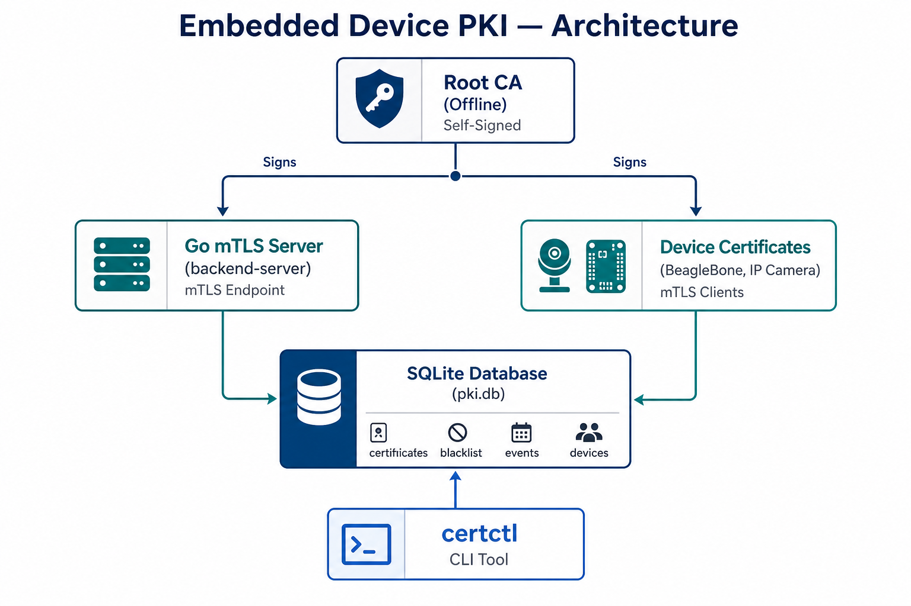
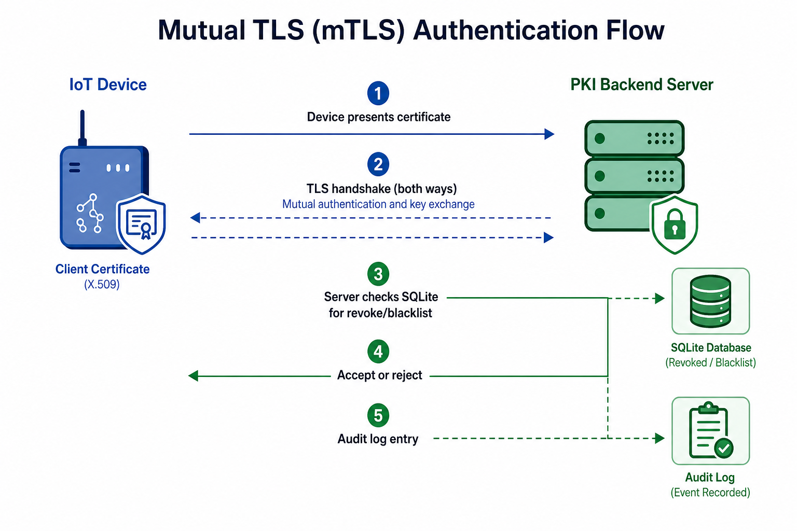
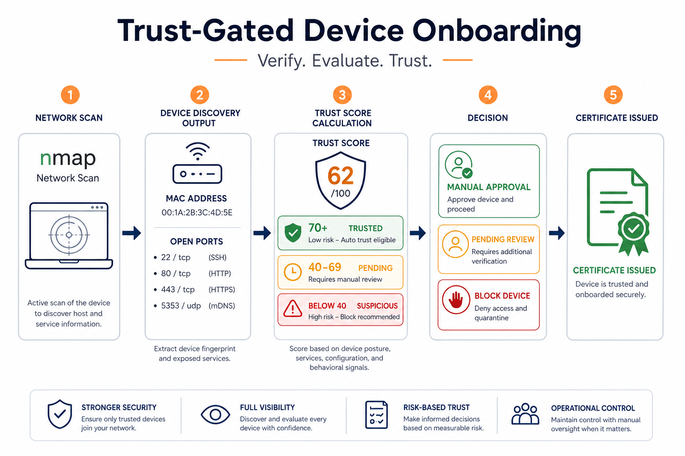
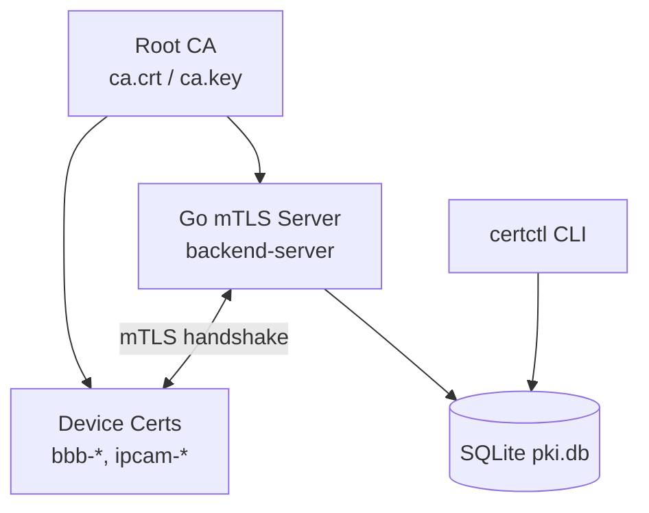
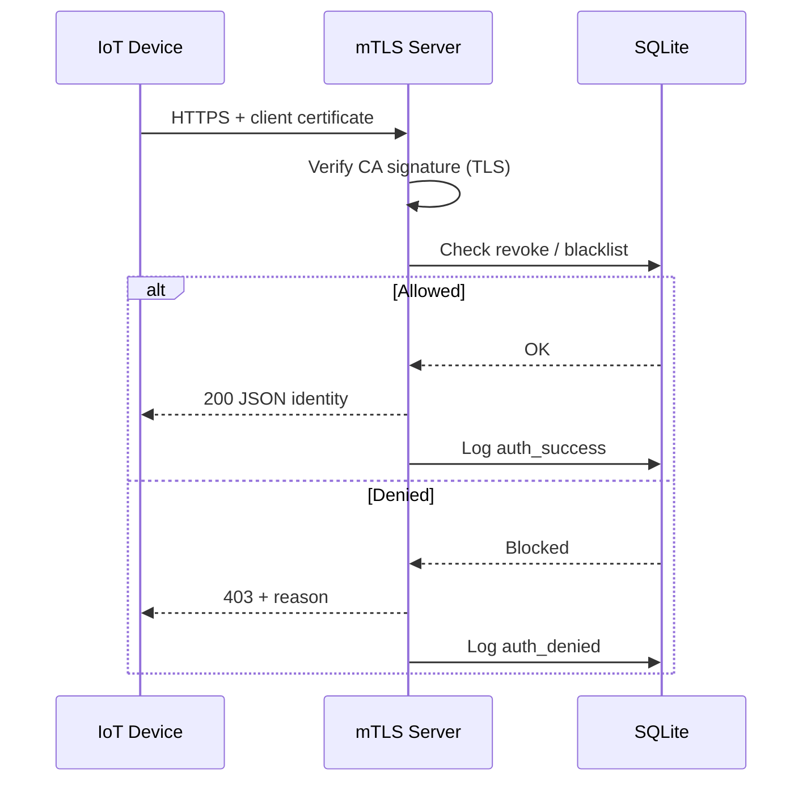
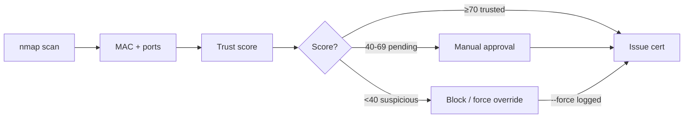

# Embedded Device PKI — LinkedIn Documentation

**GitHub Repository:** https://github.com/hashmi846003/Embedded-P.K.I

Use this document to share the project on LinkedIn. It includes a GitHub review, plain-language explanation, diagrams, and ready-to-copy post text.

---

## GitHub Repository Review

Reviewed: **hashmi846003/Embedded-P.K.I** (branch: `main`)

### What’s on GitHub

| Area | Status | Notes |
|------|--------|-------|
| README | ✅ Strong | Clear quick start, manual setup, ops commands, architecture overview |
| Go backend | ✅ Complete | mTLS server + `certctl` admin CLI |
| SQLite store | ✅ Complete | Certificates, blacklist, events, devices tables |
| Trust scoring | ✅ Complete | nmap scan + weighted trust model before cert issuance |
| Automation | ✅ Complete | `setup-pki.sh`, `onboard-device.sh`, `run-server.sh`, `test-mtls.sh`, `setup-ipcam.sh` |
| Documentation | ✅ Good | 5 docs covering trust, storage, migration, testing, IP camera |
| Security hygiene | ✅ Good | `certs/`, `*.key`, `*.db` gitignored; private keys not stored in DB |
| Build artifacts | ✅ Fixed | Compiled binaries excluded from repo (built locally by scripts) |

### Highlights worth calling out on LinkedIn

1. **Real mTLS, not a TLS-only demo** — the server verifies device identity, not just the other way around.
2. **Full certificate lifecycle** — issue, revoke, blacklist, expiry tracking, audit log.
3. **Trust-gated onboarding** — devices are scanned and scored before they receive a certificate.
4. **Tested on embedded hardware** — BeagleBone Black over USB Ethernet.
5. **Extensible design** — IP camera support via stunnel for devices without native TLS.
6. **Honest engineering** — documents real bugs found during development (serial mismatch, shell pitfalls).

### Suggested GitHub improvements (optional, post-LinkedIn)

- Add a LICENSE file
- Add GitHub Topics: `iot`, `pki`, `mtls`, `embedded`, `go`, `security`
- Pin the repo and add a short repo description on GitHub

---

## Project in Plain English

### The problem

Most IoT security demos stop at **server-side TLS**: the device checks that the server is legitimate, but the server accepts **any** client that connects. That’s one-way trust — fine for websites, weak for device fleets.

If a device is lost, compromised, or should no longer have access, you need a way to **identify it cryptographically** and **cut it off immediately** — with a record of what happened.

### The solution

This project builds a small **Public Key Infrastructure (PKI)** for embedded/IoT devices:

- A **Root Certificate Authority (CA)** signs certificates for your backend and each device.
- Devices connect using **mutual TLS (mTLS)** — both sides prove identity with certificates.
- A **Go backend** enforces policy on every request: Is this cert valid? Revoked? Is this device blacklisted?
- Everything is tracked in **SQLite**: certificates, device trust scores, and a full audit log.
- **Bash automation** handles build → scan → issue → deploy → test in one command.

### Who is this for?

- Embedded / IoT engineers exploring certificate-based device auth
- Security-minded developers building fleet management prototypes
- Anyone learning PKI, mTLS, and trust models on real hardware (BeagleBone Black)

---

## Architecture Overview



```
                    Root CA (self-signed)
                    certs/ca/ca.key  (secret)
                    certs/ca/ca.crt  (shared)
                              │
                              │ signs
              ┌───────────────┴───────────────┐
              ▼                               ▼
     backend-server                   Device certificates
     (Go mTLS server)  ◄── mTLS ──►  bbb-*, ipcam-*, ...
              │
              │  every request checked live
              ▼
         data/pki.db (SQLite)
    ┌─────────┬──────────┬─────────┬─────────┐
    │ certs   │ blacklist│ events  │ devices │
    └─────────┴──────────┴─────────┴─────────┘
              ▲
              │  certctl CLI (issue / revoke / scan / log)
```

**Key design choice:** Public certificates live in the database (`cert_pem`). Private keys stay on the filesystem only — never in SQLite. One leaked DB backup doesn’t expose every device key.

---

## How mTLS Works Here



| Step | What happens |
|------|----------------|
| 1 | Device initiates HTTPS connection and presents its client certificate |
| 2 | Server verifies the cert was signed by the project CA (TLS layer) |
| 3 | Server checks SQLite: revoked? blacklisted? (application layer) |
| 4 | If allowed → JSON response with device identity; if not → 403 + reason |
| 5 | Every attempt logged to the `events` table (success and failure) |

Revocation and blacklisting take effect on the **next connection** — no server restart.

**Revoke vs. blacklist:**
- **Revoke** — invalidates one specific certificate (normal rotation).
- **Blacklist** — blocks a device identity even if it gets a new certificate (compromise scenario).

---

## Trust-Gated Onboarding



Before a device gets a certificate, it must pass a **network scan and trust score**:

```
certctl scan <ip> <type>
        │
        ├── nmap  → open ports, service banners
        └── ARP   → MAC address (local subnet)
        │
        ▼
   Trust score (weighted, explainable)
        │
        ├── ≥ 70  → trusted      → issue allowed
        ├── 40–69 → pending      → manual approval required
        └── < 40  → suspicious   → blocked (unless --force, logged)
```

Example signals:
- Known IoT MAC vendor → +20
- Telnet / TR-069 / FTP open → −50 per risky port
- Locally-administered MAC (spoofing signal) → −30

Device IDs are derived from the scan (`bbb-a3f291`), not typed by hand — reducing naming mistakes in a fleet.

---

## Tech Stack

| Layer | Technology |
|-------|------------|
| Backend | Go (`crypto/tls`, `net/http`) |
| Crypto ops | OpenSSL (key gen, CSR, signing) |
| Database | SQLite (single source of truth) |
| Network scan | nmap + kernel ARP table |
| Automation | Bash (`setup-pki.sh`, etc.) |
| Test target | BeagleBone Black (USB Ethernet) |
| Extended use case | IP camera via stunnel TLS proxy |

---

## Key Features (bullet list for posts)

- ✅ Mutual TLS (mTLS) — server verifies devices, not just vice versa
- ✅ Root CA + per-device client certificates
- ✅ Certificate lifecycle: issue, revoke, blacklist, unblacklist
- ✅ Expiry tracking (`certctl expiring`)
- ✅ Full audit log (every auth attempt, scan, override)
- ✅ Trust scoring before certificate issuance
- ✅ Public certs in DB; private keys on filesystem only
- ✅ One-command setup: `./setup-pki.sh 192.168.7.2 bbb debian --yes`
- ✅ IP camera path with stunnel for non-TLS devices
- ✅ Verified on real embedded hardware (BeagleBone Black)

---

## Quick Demo Commands

```bash
git clone https://github.com/hashmi846003/Embedded-P.K.I.git
cd Embedded-P.K.I

chmod +x setup-pki.sh onboard-device.sh run-server.sh test-mtls.sh
./setup-pki.sh 192.168.7.2 bbb debian --yes
```

Day-to-day fleet ops:

```bash
cd server
./certctl list
./certctl expiring
./certctl revoke bbb-a3f291 "lost device"
./certctl blacklist ipcam-01 "compromised"
./certctl log
```

---

## Ready-to-Post LinkedIn Text

### Option A — Short post (with 1 image: architecture diagram)

```
Built an Embedded Device PKI for IoT fleet security 🔐

Most IoT demos only do server-side TLS — the device trusts the server, but the server accepts anyone. This project implements mutual TLS (mTLS): every device must present a certificate the backend issued, and the server can revoke or blacklist it instantly.

What's inside:
• Go mTLS backend + certctl admin CLI
• SQLite-backed certificate lifecycle & audit log
• Trust-gated onboarding (nmap scan + scoring before issuance)
• Tested on BeagleBone Black
• One-command bash automation

Repo: https://github.com/hashmi846003/Embedded-P.K.I

#IoT #EmbeddedSystems #CyberSecurity #PKI #mTLS #GoLang #BeagleBone #OpenSource
```

Attach: `docs/linkedin/architecture-diagram.png`

---

### Option B — Medium post (carousel: 3 diagrams)

**Slide 1 caption (architecture):**
> System architecture: Root CA → mTLS server + device certs → SQLite fleet database, managed by certctl CLI.

**Slide 2 caption (mTLS flow):**
> Every connection: TLS handshake → revocation/blacklist check → allow or deny → audit log entry.

**Slide 3 caption (trust onboarding):**
> Devices are scanned and scored before receiving a certificate. Risky ports (telnet, TR-069) block automatic issuance.

**Post text:**

```
I recently built a Public Key Infrastructure (PKI) project for embedded IoT devices — and open-sourced it on GitHub.

The goal: move beyond "TLS on the server" to true device identity. Each device gets its own certificate. The backend verifies it on every request and can revoke or blacklist access without restarting anything.

What I learned building this:
1. mTLS is the easy part — lifecycle management (revoke, blacklist, expiry, audit) is where PKI gets real.
2. Trust-gated onboarding matters: scan the device before you issue a cert.
3. Keep private keys off the database. Public certs in SQLite; keys on disk only.

Stack: Go, OpenSSL, SQLite, nmap, Bash automation
Hardware: BeagleBone Black over USB Ethernet

Clone & run:
https://github.com/hashmi846003/Embedded-P.K.I

Would love feedback from embedded and security folks — what would you add for production?

#IoTSecurity #Embedded #PKI #mTLS #CertificateManagement #Go #Linux #BeagleBoneBlack #OpenSource #CyberSecurity
```

Attach all three images from `docs/linkedin/` as a carousel.

---

### Option C — Technical deep-dive (for article-style post)

```
🔐 Embedded Device PKI — Certificate-Based IoT Fleet Security

I built and open-sourced a working PKI for IoT/embedded devices. Here's what it does and why it matters.

THE PROBLEM
Server-side TLS alone doesn't identify devices. If a board is compromised or decommissioned, you need cryptographic identity + instant revocation — not just a shared password or API key.

THE APPROACH
• Root CA signs server + device certificates
• Go backend enforces tls.RequireAndVerifyClientCert
• SQLite stores cert state, blacklist, trust scores, and a full event log
• certctl CLI wraps OpenSSL for issuance and fleet ops
• Bash scripts automate build → scan → trust → issue → deploy → test

STANDOUT DETAILS
• Trust scoring (nmap + MAC) gates certificate issuance
• Revoke vs blacklist modeled separately (rotation vs compromise)
• Public certs stored in DB; private keys never touch SQLite
• IP camera support via stunnel for devices without native TLS
• Real bugs documented (hex/decimal serial mismatch, shell cd && & pitfall)

TRY IT
git clone https://github.com/hashmi846003/Embedded-P.K.I.git
./setup-pki.sh 192.168.7.2 bbb debian --yes

GitHub: https://github.com/hashmi846003/Embedded-P.K.I

#IoT #EmbeddedSystems #Security #PKI #mTLS #GoLang #SQLite #DevOps #Infosec
```

---

## Diagram Files (for upload)

| File | Use on LinkedIn |
|------|-----------------|
| `docs/linkedin/architecture-diagram.png` | Main hero / cover image |
| `docs/linkedin/mtls-flow-diagram.png` | Carousel slide 2 — authentication |
| `docs/linkedin/trust-onboarding-diagram.png` | Carousel slide 3 — onboarding |

---

## Mermaid Diagrams (for GitHub / Notion / slides)

Copy these into GitHub README, Notion, or slide tools that render Mermaid.

### Architecture



### mTLS request path



### Trust onboarding



---

## One-Line Elevator Pitch

> Open-source PKI for IoT devices: mutual TLS, trust-gated certificate issuance, live revocation, and full audit logging — tested on BeagleBone Black.

**Link:** https://github.com/hashmi846003/Embedded-P.K.I
