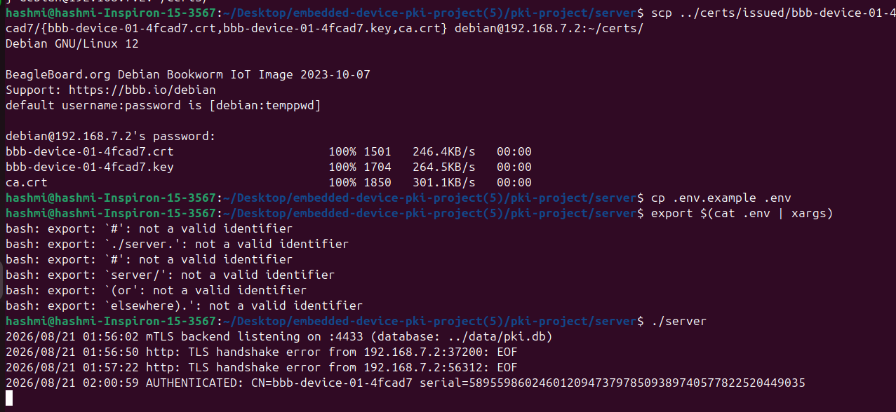
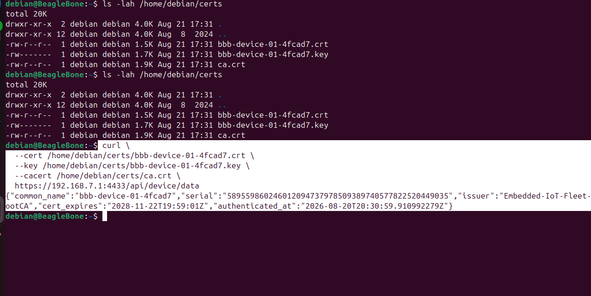

# Proof of Work — BeagleBone Black mTLS Verification

Real terminal output from end-to-end testing on a **BeagleBone Black** (Debian) over USB Ethernet.

- **Device IP:** `192.168.7.2`
- **Server IP:** `192.168.7.1:4433`
- **Device identity:** `bbb-device-01-4fcad7`
- **CA:** `Embedded-IoT-Fleet-RootCA`

---

## 1. Server side — deploy certs and authenticate device

Certificate files were copied to the BeagleBone with SCP. The Go mTLS backend was started and logged a successful authentication.



**What happened:**
1. `scp` — transferred `bbb-device-01-4fcad7.crt`, `.key`, and `ca.crt` to `debian@192.168.7.2:~/certs/`
2. `./server` — backend listening on port 4433, using `../data/pki.db`
3. `AUTHENTICATED: CN=bbb-device-01-4fcad7 serial=589559860246012094737978509389740577822520449035`

Earlier `TLS handshake error ... EOF` lines in the log are from failed attempts before the correct certificate was in place — normal during setup.

---

## 2. Device side — mTLS curl and JSON response

From the BeagleBone, `curl` presents the device certificate. The server verifies it and returns identity JSON.



**Command run on the device:**

```bash
curl \
  --cert /home/debian/certs/bbb-device-01-4fcad7.crt \
  --key  /home/debian/certs/bbb-device-01-4fcad7.key \
  --cacert /home/debian/certs/ca.crt \
  https://192.168.7.1:4433/api/device/data
```

**Response:**

```json
{
  "common_name": "bbb-device-01-4fcad7",
  "serial": "589559860246012094737978509389740577822520449035",
  "issuer": "Embedded-IoT-Fleet-RootCA",
  "cert_expires": "2028-11-22T19:59:01Z",
  "authenticated_at": "2026-08-20T20:30:59.910992279Z"
}
```

The serial in the JSON matches the `AUTHENTICATED` line in the server log — same device, same session, both sides confirmed.

---

## What this proves

| Claim | Evidence |
|-------|----------|
| Certificates issued and deployed to real hardware | SCP output + files on device (`ls ~/certs/`) |
| Server enforces mTLS | Server requires client cert; handshake succeeds with valid cert |
| Device identity returned after auth | JSON with `common_name`, `serial`, `issuer`, `cert_expires` |
| Server and device agree on identity | Matching serial in server log and JSON response |
| Not a localhost-only demo | BeagleBone at `192.168.7.2` → PC at `192.168.7.1` |

---

## Reproduce

```bash
./setup-pki.sh 192.168.7.2 bbb debian --yes
# or manually:
./onboard-device.sh 192.168.7.2 bbb debian --yes
./run-server.sh --background
./test-mtls.sh 192.168.7.2 debian
```
